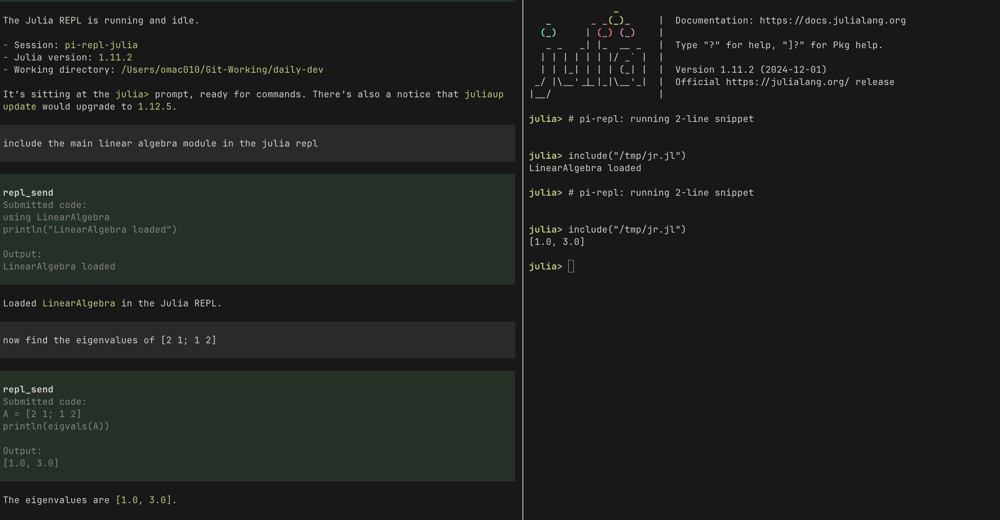

# pi-repl

Minimal [pi](https://github.com/badlogic/pi-mono) extension for collaborative REPL sessions using tmux.

`pi-repl` starts a shared Python, IPython, or Julia REPL in tmux that you can attach to from another terminal window. You can work in the REPL directly, or ask pi to send and execute code there.



*Interacting with a shared Julia REPL.*

## Current scope

Currently, `pi-repl` supports **Python/IPython** and **Julia**. **R** support is planned.

With `pi-repl` you can:

- start a shared REPL from pi
- attach to that REPL from another terminal window
- work in the REPL yourself as normal
- ask pi, in natural language, to run code in the shared REPL
- let pi read the raw shared REPL transcript for extra context when needed
- check which shared REPL sessions are running
- inspect which Python interpreter and environment the shared Python/IPython REPL is using with `/repl env`
- stop the shared REPL when you are done

Use `/lab` as a short alias for `/repl`.

## Install

From npm:

```bash
pi install npm:pi-repl
```

From GitHub:

```bash
pi install https://github.com/omaclaren/pi-repl
```

Restart pi after installing.

## Commands

| Command | Description |
|---------|-------------|
| `/repl` | Show usage |
| `/lab` | Alias for `/repl` |
| `/repl python` | Start the shared Python/IPython session with `python` |
| `/repl ipython` | Start the shared Python/IPython session with `ipython` |
| `/repl julia` | Start the shared Julia session with `julia` |
| `/lab python` | Same as `/repl python` |
| `/lab ipython` | Same as `/repl ipython` |
| `/lab julia` | Same as `/repl julia` |
| `/repl status` | Show running shared REPL sessions |
| `/repl status python` | Show status for the shared Python/IPython session |
| `/repl status julia` | Show status for the shared Julia session |
| `/repl env` | Show which interpreter and environment the shared Python/IPython REPL is using |
| `/repl attach` | Show how to attach from a new terminal window |
| `/repl attach julia` | Show how to attach to the shared Julia session |
| `/repl stop` | Stop the shared session if only one is running |
| `/repl stop python` | Stop the shared Python/IPython session |
| `/repl stop julia` | Stop the shared Julia session |

## Tools used by pi

`pi-repl` also exposes tools that pi can use internally. In normal use, you can just ask pi to run code in the shared REPL or use the `/repl` commands directly.

| Tool | Description |
|------|-------------|
| `repl_status` | Inspect shared Python/IPython and Julia REPL state |
| `repl_send` | Execute code in the running shared Python/IPython or Julia session |

Notes:

- `repl_status` is what pi uses to check which shared REPL sessions are currently running
- while a shared REPL is running, `repl_status` also exposes the raw session history log path
- pi can read that history file for context about what has already happened in the shared REPL
- the relevant shared session must already be running before `repl_send`
- you can ask pi naturally to run code in Python, IPython, or Julia; pi chooses the tool parameters internally
- for plain Python, `print(...)` is the safest way to get values back reliably
- tool output includes both the submitted code and the captured output

## Shared sessions

The default shared tmux session names are:

- `pi-repl-python` for Python/IPython
- `pi-repl-julia` for Julia

The Python/IPython session can currently be launched in either:

- `python` mode
- `ipython` mode

## Attaching

After running `/repl attach`, open a new terminal window and run the tmux command shown by pi. For example:

```bash
tmux attach -t pi-repl-python
```

## Example workflow

```text
/repl ipython
/repl env
/repl status
/repl attach

/repl julia
/repl status julia
/repl attach julia
```

Example requests once the REPL is running:

- `run print(sys.executable) in the shared Python REPL`
- `inspect the current globals in the shared Python REPL`
- `in the shared Julia REPL, load LinearAlgebra`
- `now find the eigenvalues of [2 1; 1 2] in the shared Julia REPL`

## Notes

- `tmux` is required.
- While a shared REPL is running, `pi-repl` keeps a raw transcript log of the tmux pane output for that session.
- That transcript is plain text and may include prompts, echoed input, output, and errors.
- `/repl env` is currently implemented for Python/IPython only.

## Related extensions

[`pi-interactive-shell`](https://github.com/nicobailon/pi-interactive-shell) offers related but distinct functionality for interactive CLI sessions in pi, including overlay-based interaction and user take-over. `pi-repl` is focused specifically on shared tmux-backed REPL sessions.

## License

MIT
